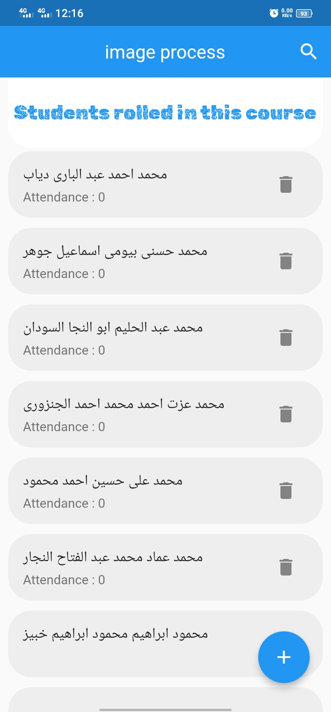
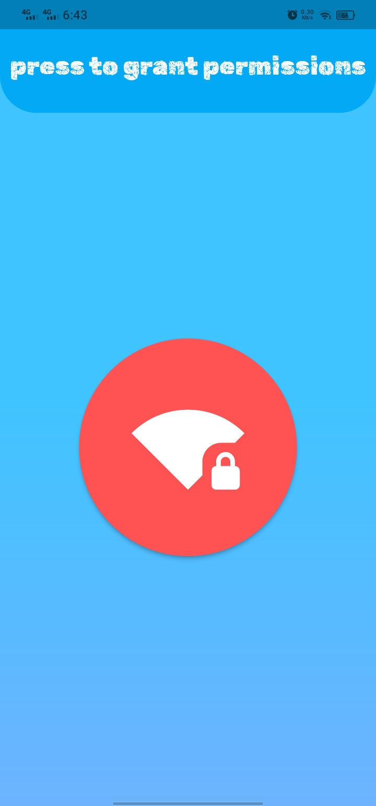

# E-sheet
E sheet is an app that makes taking attendance of students easy and convenient. With e sheet, you can create and manage attendance records using your device’s hotspot. You can also share and export the records to other formats.
- creating this app make taking attendance is very simple and fast way
- one of most important problem that faculty not providing access to database so I created a new method to fill data whiteout using this database
- I have learned clean architecture and how to separate component of the project and other skills like responsive screen , local database management, accessing phone storage and providing required permissions .
## Usage
**in first open of application it will show like this****** 
 
**this page show in first time only and have validator on text field like this: **
 
**after adding your name will navigate to this page that contain all courses in your database **
 
**now we need to add some courses to our database we will go to settings page **
 
**and chose import to open this page **
 
**we need to select excel file from our storage **
 
**view content of excel file **
 
**add name to this course **
 
**back to main screen you will find added course **
 
**now you can show students in this course and attendance times** 
 
**you can use search to find any student using name** (**search show all names contain this string**) 
 
 
**you can do CURD functions like** 
 
 
 
**now most important part how to take attendance you need to open connection screen** 
 
**in first time the button will show red which mean you need to grant some permissions** 
 
**now you can press to start connection** 
 
**select  course you want to take attendance** 
 
**now  wait untile all student take attendance using** [student marker](https://github.com/xXhalemXx/student_marker) 
 
**after  finishing close this page** 
 
**now we done take attendance and saved in our database if we need to** 
**export this data we go to settings and  chose export this time** 
 
**select  course you want to export it and it will show location that you can find**  
**excel file that contain all students and attendance times and when they attended** 
 
 
