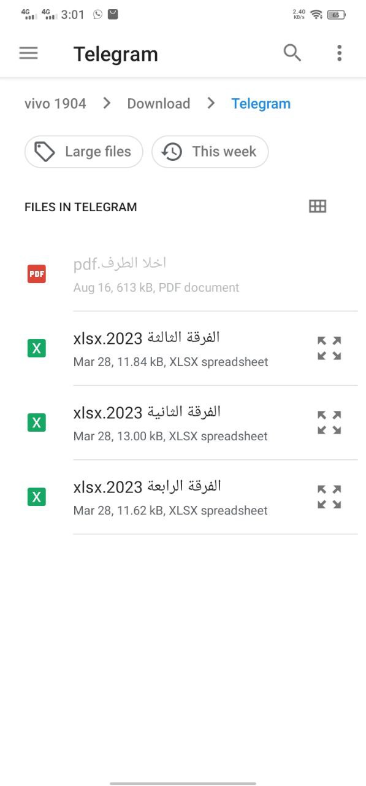

# E-sheet
E sheet is an app that makes taking attendance of students easy and convenient. With e sheet, you can create and manage attendance records using your device’s hotspot. You can also share and export the records to other formats.
- creating this app make taking attendance is very simple and fast way
- one of most important problem that faculty not providing access to database so I created a new method to fill data whiteout using this database
- I have learned clean architecture and how to separate component of the project and other skills like responsive screen , local database management, accessing phone storage and providing required permissions .
## Usage
in first open of application it will show like this 
 
this page show in first time only and have validator on text field like this: 
 
after adding your name will navigate to this page that contain all courses in your database 
 
now we need to add some courses to our database we will go to settings page 
 
and chose import to open this page 
 
we need to select excel file from our storage 
 
view content of exel file 
 
add name to this course 
 
back to main screen you will find added course 
 
